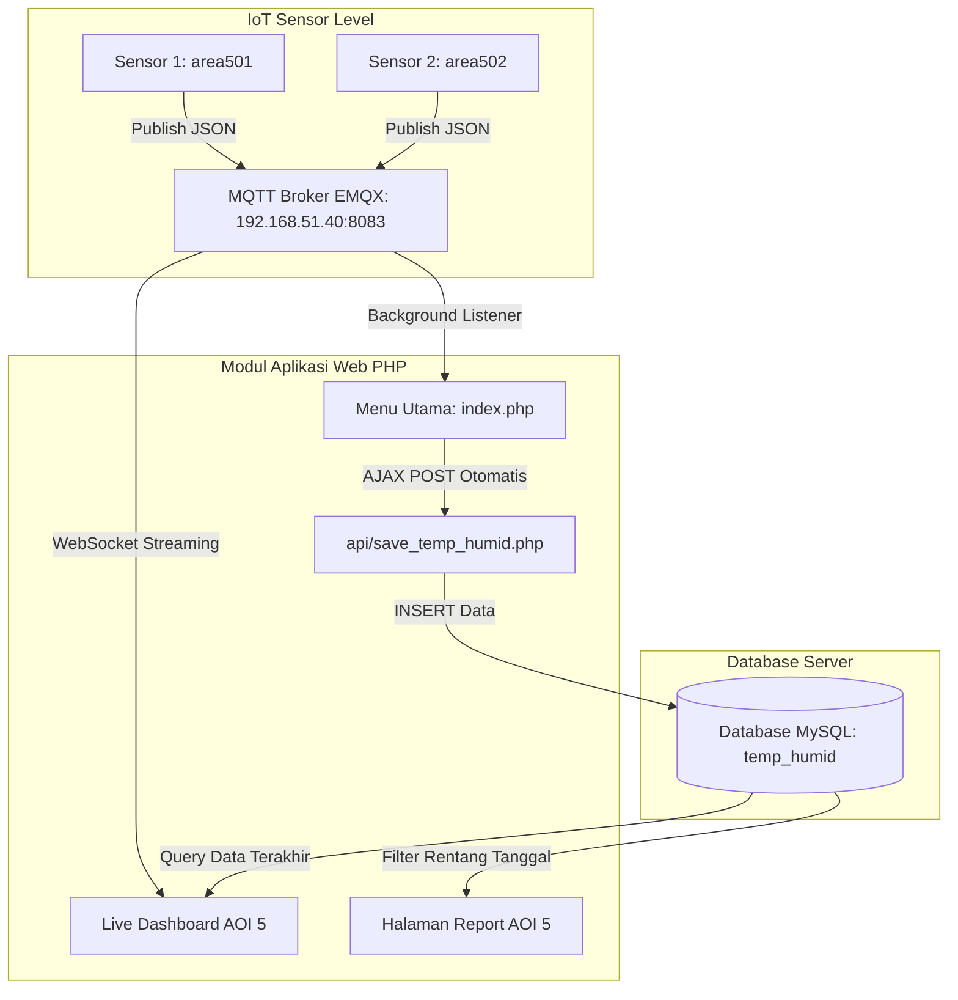

# Laporan Lengkap Pembuatan & Update Sistem Monitoring Temperature & Humidity AOI 5
**Project:** Enviro Monitoring System  
**Factory:** AOI 5  
**Modul:** Temperature & Humidity (Dashboard, Report, & Auto-Save API)  
**Terakhir Diperbarui:** 01 Oktober 2026  

---

## 1. Ringkasan Eksekutif

Laporan ini mendokumentasikan implementasi menyeluruh (*end-to-end*) sistem monitoring **Temperature & Humidity** untuk area **AOI 5** pada portal *Enviro* beserta pembaruan spesifikasi MQTT Broker EMQX. 

Sistem ini mencakup 5 pilar utama:
1. **Live Dashboard Visual**: Menampilkan jarum gauge Highcharts dan indikator LED alarm secara *real-time* via MQTT WebSocket.
2. **Halaman Report & Riwayat**: Menampilkan rekaman data historis dengan filter rentang tanggal (*DateRangePicker*) serta fitur ekspor CSV & Excel.
3. **API Auto-Save Ingestion (`api/save_temp_humid.php`)**: Endpoint backend PHP untuk menyimpan data sensor langsung ke tabel database **`temp_humid`**.
4. **Background Service di Menu Utama (`index.php`)**: Menangkap pesan MQTT dan meneruskannya ke API database di latar belakang tanpa mengubah tampilan antarmuka visual menu utama.
5. **Deployment-Ready**: Seluruh file murni berbasis PHP, JavaScript, dan CSS sehingga **100% siap diunggah ke server via FileZilla** tanpa perlu instalasi package tambahan.

---

## 2. Parameter & Spesifikasi Teknis Terbaru

| Komponen | Spesifikasi | Keterangan |
| :--- | :--- | :--- |
| **Factory Target** | `AOI 5` | Area pabrik AOI 5 |
| **Jumlah Sensor** | 2 Sensor | Sensor 1 (`501` / `area501`) dan Sensor 2 (`502` / `area502`) |
| **Topic MQTT Sensor 1** | `data/temperature/area501/+` | Topic data Sensor 1 (Area 1) |
| **Topic MQTT Sensor 2** | `data/temperature/area502/+` | Topic data Sensor 2 (Area 2) |
| **Format Payload MQTT** | JSON Object | `{"_terminalTime":"2026-10-01 07:51:00.392","_groupName":"Area_1","temper":"31.5","humidi":"61.2"}` |
| **MQTT Broker** | EMQX (`192.168.51.40:8083`) | WebSocket Paho Client (`mqtt/mqttws31.js`) |
| **Database Server** | MySQL (`192.168.51.40`) | Database: `enviro` |
| **Tabel Penyimpanan** | `temp_humid` | Kolom: `id_transaction`, `id_location`, `temp`, `humidity`, `record_time` |

---

## 3. Arsitektur Alur Data Sistem



---

## 4. Rincian File yang Dikerjakan

### A. Live Dashboard: `dashboard/temperature/aoi5/index.php`
* **Visualisasi Dual Gauge**: Menampilkan Highcharts Gauge untuk Suhu (10°C–45°C) dan Kelembapan (30%–100%) untuk Sensor 1 (`area501`) dan Sensor 2 (`area502`).
* **Indikator Alarm LED**: Lampu LED bulat yang menyala merah berkedip (*pulsing alert*) jika suhu/kelembapan masuk ke zona bahaya (*Red Zone*).
* **Koneksi MQTT WebSocket**: Menerima streaming JSON dari topic `data/temperature/area501/+` dan `data/temperature/area502/+` langsung dari broker EMQX `192.168.51.40:8083`.
* **Integrasi Database & Auto-Save**: Mengambil nilai terakhir (*latest record*) saat halaman pertama kali dibuka, serta dilengkapi *Auto-Save Ingestion* mandiri sehingga data tetap tersimpan ke tabel `temp_humid` meskipun hanya halaman dashboard yang dibuka.

### B. Halaman Report: `report/temperature/aoi5/index.php`
* **Filter Rentang Tanggal**: Menggunakan widget *DateRangePicker* dengan opsi cepat (*Hari Ini, Kemarin, 7 Hari Terakhir, 30 Hari Terakhir, Bulan Ini, Bulan Lalu*).
* **Tabel Interaktif**: Menggunakan *DataTables* lengkap dengan pagination, searching, sorting, dan status badge warna pada nilai suhu & kelembapan.
* **Fitur Ekspor**: Tombol **Export CSV** dan **Export Excel** untuk mengunduh laporan ke file spreadsheet.

### C. Backend API: `api/save_temp_humid.php`
* **Fungsi**: Endpoint penampung data untuk dieksekusi ke database.
* **Normalisasi Data**: Memetakan key sensor (`area501` / `Area_1` / `501` $\rightarrow$ `501`, `area502` / `Area_2` / `502` $\rightarrow$ `502`), mengekstrak nilai float `temper` dan `humidi`, serta mengatur format waktu `record_time`.
* **Format ID Transaksi**: Membentuk `id_transaction` otomatis dengan format `[id_location]_[YYYYMMDD]_[HHmmss]` (contoh: `501_20261001_075100`).
* **Respon JSON**: Mengembalikan status `success` atau `error` yang terstruktur.

### D. Menu Utama: `index.php`
* **Tampilan Visual Tetap 100% Asli**: Tidak ada perubahan layout atau tampilan visual yang diubah.
* **Background Ingestion Service**: Memuat script JavaScript di latar belakang yang mendengarkan topic `data/temperature/area501/+` & `data/temperature/area502/+`, lalu secara otomatis melakukan AJAX POST ke `api/save_temp_humid.php` setiap ada data sensor masuk.

---

## 5. Struktur Tabel Database `temp_humid`

Struktur 5 kolom utama pada tabel `temp_humid`:

| Nama Kolom | Tipe Data | Contoh Nilai | Deskripsi |
| :--- | :--- | :--- | :--- |
| **`id_transaction`** | `VARCHAR` | `501_20261001_075100` | ID transaksi unik berformat `[id_loc]_[timestamp]` |
| **`id_location`** | `VARCHAR` | `501` / `502` | ID penanda sensor (501 = Sensor 1, 502 = Sensor 2) |
| **`temp`** | `DOUBLE / FLOAT` | `31.5` | Nilai suhu (°C) |
| **`humidity`** | `DOUBLE / FLOAT` | `61.2` | Nilai kelembapan (%) |
| **`record_time`** | `DATETIME` | `2026-10-01 07:51:00` | Waktu pencatatan data sensor |

---

## 6. Panduan Pengujian & URL Akses

### A. Daftar URL Aplikasi
* **Menu Utama Portal**:  
  `http://localhost/enviro/index.php` (atau `http://localhost:8000/index.php`)
* **Live Dashboard AOI 5**:  
  `http://localhost/enviro/dashboard/temperature/aoi5/`
* **Halaman Report AOI 5**:  
  `http://localhost/enviro/report/temperature/aoi5/`
* **Endpoint API Auto-Save**:  
  `http://localhost/enviro/api/save_temp_humid.php`

### B. Contoh Pengujian Kirim Data MQTT
Kirim payload berikut ke broker EMQX `192.168.51.40`:
* **Topik Sensor 1:** `data/temperature/area501/state` (atau subtopic lainnya dengan prefix `data/temperature/area501/`)  
  **Payload:**
  ```json
  {"_terminalTime":"2026-10-01 07:51:00.392","_groupName":"Area_1","temper":"31.5","humidi":"61.2"}
  ```
* **Topik Sensor 2:** `data/temperature/area502/state` (atau subtopic lainnya dengan prefix `data/temperature/area502/`)  
  **Payload:**
  ```json
  {"_terminalTime":"2026-10-01 07:51:00.392","_groupName":"Area_2","temper":"29.8","humidi":"65.4"}
  ```

---

## 7. Petunjuk Deployment Menggunakan FileZilla

1. Buka aplikasi **FileZilla** dan hubungkan ke server web.
2. Unggah (*upload*) folder dan file berikut ke direktori root web server:
   * 📁 `dashboard/temperature/aoi5/`
   * 📁 `report/temperature/aoi5/`
   * 📁 `api/save_temp_humid.php`
   * 📄 `index.php`
3. Selesai! Sistem langsung aktif dan dapat diakses dari browser.
